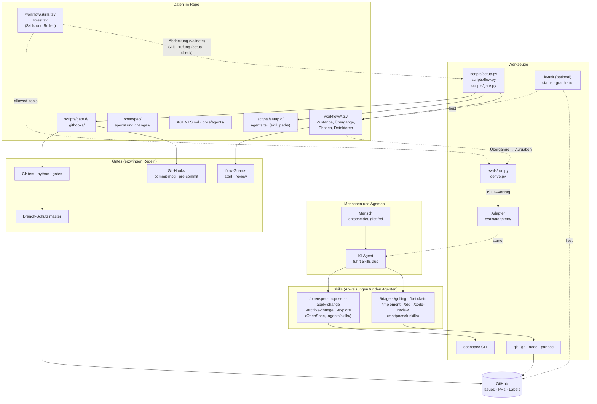
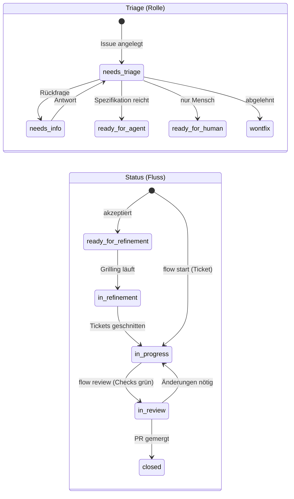
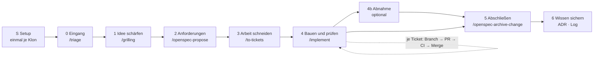

# 1. Landkarte: Bausteine, Zustände, Phasen

## Bausteine

Faustregel aus `docs/workflow.md`: **Das Modell urteilt** (Spezifikation, Code, Review), **Skripte und CI erzwingen** Übergänge und Prüfpunkte.

## Baustein-Tabelle

| Baustein | Zweck | Pflicht? | Wo / Aufruf |
| --- | --- | --- | --- |
| `git`, `gh` (angemeldet) | Versionsverwaltung, Issues, PRs | Pflicht | `gh auth status` |
| Python ≥ 3.11 | `scripts/` (nur Standardbibliothek) | Pflicht | `python3 --version` |
| Node ≥ 20.19, `openspec` ≥ 1.14 | Specs und Changes | Pflicht | `openspec --version` |
| `pandoc` ≥ 3.1 | Build der Seite (nur dieses Repo) | Pflicht (Teil B) | `pandoc --version` |
| KI-Agent + Skills | führt die Phasen aus | optional (alles geht von Hand) | `/plugin` |
| `scripts/setup.py` | Klon einrichten: Prüfung, Hooks, Adapter, Labels | Pflicht (einmal je Klon) | `python3 scripts/setup.py --check` |
| `scripts/flow.py` | Prozessdaten prüfen, Ticket starten, in Review geben | Pflicht für Prozessdaten, `start`/`review` optional | `flow validate` |
| `scripts/gate.py` | Commit-Lint, Secret-Scan | Pflicht (läuft in Hook und CI) | `gate commits`, `gate secrets` |
| `workflow/skills.tsv`, `roles.tsv` | welcher Skill welche Phase trägt, welche Rolle was darf; Abdeckung und Skill-Prüfung | Pflicht (Prozessdaten) | `flow validate`, `setup --check` |
| `agents.tsv` `skill_paths` | Orte der Skills je Agent, nie geraten | Pflicht für die Skill-Prüfung | `scripts/setup.d/agents.tsv` |
| Evals `evals/run.py` | prüft, ob der Agent den Prozess einhält | optional (kostet echtes Geld) | `python3 evals/run.py` |
| Adapter `evals/adapters/` | startet den Agenten für die Evals (JSON-Vertrag, jede Sprache) | optional (nur für Evals) | `--adapter <programm>` |
| Abgeleitete Aufgaben `evals/derive.py` | je Guard eine Aufgabe "Übergang muss abbrechen" | optional (Teil der Evals) | automatisch bei `run.py` |
| kvasir | Sicht auf Status, Graph, TUI | **optional, empfohlen** | `kvasir status '#N'` |
| Git-Hooks `.githooks/` | frühe Rückmeldung beim Commit | empfohlen (CI ist verbindlich) | `core.hooksPath` |
| CI (`test.yml`) | verbindliche Prüfung je PR | Pflicht | GitHub Actions |
| Branch-Schutz | PR nur mit grünen Checks | Pflicht (Einstellung des Repo-Eigners) | GitHub-Einstellungen |

## Zwei Dimensionen am Issue

Jedes Ticket trägt **eine Triage-Rolle** (wer ist am Zug) und ab der Bearbeitung **einen Status** (wo steht die Arbeit). Quelle: `workflow/states.tsv` und `transitions.tsv`.

- **Feature-Issue** (Elternteil): durchläuft `ready-for-refinement` → `in-refinement`, danach hängen die Tickets als Sub-Issues darunter.
- **Ticket** (Blatt): bekommt `ready-for-agent`, dann `flow start` → `in-progress` → `flow review` → `in-review` → gemergt, Issue schließt, **Status-Label entfernen** (kein Label bei `closed`).

## Phasen

Die Phasen stehen als Daten in `workflow/phases.tsv` (Spalten `id`, `name`, `tool`, `done_when`, `level`). `done_when` benennt die **Beobachtung**, an der man die Phase als erledigt erkennt (z. B. `subissues_exist`). Daran liest kvasir den Stepper ab.

## Wer darf was entscheiden (menschliche Gates)

| Entscheidung | Wer | Wo sichtbar |
| --- | --- | --- |
| Ticket akzeptiert und geschärft | Mensch | Antworten im Grilling, Label `ready-for-agent` |
| Change (Proposal, Specs, Design, Tasks) freigeben | Mensch | Freigabe vor `/to-tickets` |
| Tickets freigeben | Mensch | Ticketliste vor der Anlage |
| Merge eines PR | Mensch, oder Agent **nur im ausdrücklich erteilten Umfang** bei grüner CI | PR-Historie |
| Branch-Schutz ändern | nur Repo-Eigner | GitHub-Einstellungen |

Grundlage: der Abgleich mit dem Playbook in [../playbook-abgleich.md](../playbook-abgleich.md).
