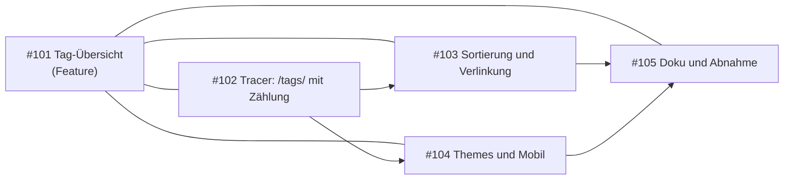
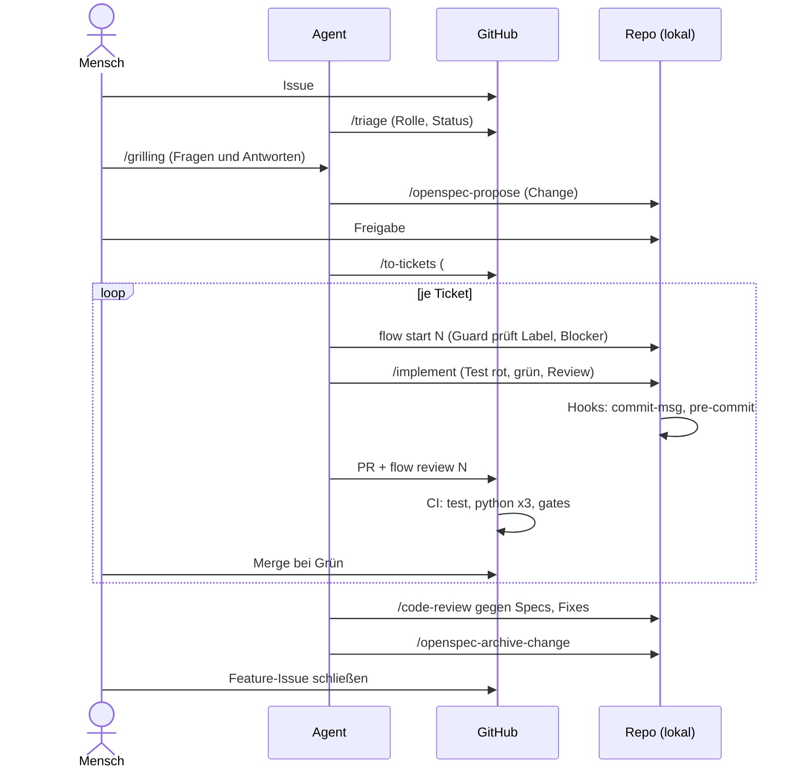

# 2. Beispiel: ein Feature durch alle Phasen (ohne kvasir)

Feature **"Tag-Übersicht"**: `/tags/` listet jeden Tag mit der Anzahl seiner Beiträge. Alle Schritte nur mit `git`, `gh`, `openspec`, den Skripten unter `scripts/` und (optional) einem Agenten.

Ticketnummern des Beispiels sind **illustrativ** (#101 bis #105). Ausgaben mit **echt** stammen aus einem Lauf in diesem Repo.



Durchgezogene Pfeile sind `blocked_by`-Beziehungen (der Pfeil zeigt vom Vorgänger zum Abhängigen), die Linien ohne Spitze sind Sub-Issue-Beziehungen.

---

## Phase S: Setup (einmal je Klon)

**Wer:** Mensch. **Ziel:** Der Klon kann den Prozess ausführen.

```sh
git clone git@github.com:comcy/comcy.github.io.git && cd comcy.github.io
python3 scripts/setup.py --check      # prüft nur, ändert nichts
python3 scripts/setup.py claude       # richtet Hooks und den Adapter für Claude Code ein
python3 scripts/flow.py validate      # Prozessdaten konsistent?
```

**echt** (vor dem Einrichten, auf einem Klon ohne Hooks):

```
ok      git 2.56.0
ok      gh 2.102.0
ok      node 26.10.0
ok      openspec 1.14.0
ok      pandoc 3.11
ok      kvasir vorhanden
FEHLT   core.hooksPath auf .githooks setzen (Abhilfe: python3 scripts/setup.py (Windows: py -3 scripts\setup.py))
1 Fehler, 0 Warnungen, 0 Hinweise
```

**echt** (danach):

```
erledigt core.hooksPath auf .githooks setzen
0 Fehler, 0 Warnungen, 0 Hinweise
```

und `flow validate --strict`: `0 Fehler, 0 Warnungen`.

Was `setup` tut: Programme aus `scripts/setup.d/tools.tsv` prüfen, `core.hooksPath` auf `.githooks` setzen, Adapter für gewählte Agenten anlegen (`openspec init --tools agents,claude`) und deren Ordner in `.git/info/exclude` eintragen. Mit `--labels` legt es zusätzlich fehlende Labels aus `workflow/states.tsv` an (einmal je Repo, schreibt auf GitHub).

**Gate:** Pflichtprogramme fehlen → `setup` bricht vor jeder Änderung ab. **Optional:** Agent-Adapter, `--labels`, kvasir.

---

## Phase 0: Eingang

**Wer:** Mensch legt an, Agent oder Mensch triagiert. **Ziel:** Das Issue hat eine Triage-Rolle.

```sh
gh issue create --title "Tag-Übersicht: /tags/ mit Anzahl der Beiträge" \
  --body "Besucher sollen sehen, welche Themen es gibt und wie viele Beiträge je Tag existieren."
# -> Issue #101, Label needs-triage
```

`/triage` (Agent) liest das Issue, stellt Rückfragen und setzt die Rolle: `needs-info` (Rückfrage an den Autor), `ready-for-agent` (reicht für einen Agenten), `ready-for-human` oder `wontfix`. Das Feature-Issue bekommt zusätzlich den Status `status:ready-for-refinement`, weil es noch geschärft werden muss.

```sh
gh issue edit 101 --add-label status:ready-for-refinement
```

**Gate:** `has_label_kind:triage` (Phase gilt als erledigt, sobald eine Triage-Rolle am Issue hängt). **Optional:** `/triage` (das Label lässt sich auch von Hand setzen).

---

## Phase 1: Idee schärfen

**Wer:** Mensch und Agent im Gespräch. **Ziel:** Entscheidungen statt Vermutungen.

`/grilling` stellt **eine Frage nach der anderen**, jeweils mit Empfehlung, und erkundet das Repo selbst, wo es die Antwort dort findet:

```
Agent:  Frage 1: Welche Tags zählen? Alle aus dem Frontmatter, oder nur Posts mit Datum?
        Empfehlung: nur veröffentlichte Posts (kein draft, mit date:), wie beim Blogindex.
Mensch: Passt.
Agent:  Frage 2: Reihenfolge der Liste? Empfehlung: nach Anzahl absteigend, bei Gleichstand alphabetisch.
Mensch: Alphabetisch, Anzahl nur als Zusatz.
...
```

Das Ergebnis (Entscheidungen, Rest-Fragen) steht als Zusammenfassung im Issue-Kommentar. Alternative bei offener Richtung: `/openspec-explore` (freies Denken, ohne Artefakte). Bei sehr großen Vorhaben vorher `/wayfinder`.

```sh
gh issue edit 101 --remove-label status:ready-for-refinement --add-label status:in-refinement
```

**Gate:** `openspec_change_exists` (die Phase gilt als erledigt, sobald es einen Change gibt). **Optional:** `/grilling` kann ein Mensch allein durch eine Checkliste ersetzen.

---

## Phase 2: Anforderungen festhalten

**Wer:** Agent schreibt, Mensch gibt frei. **Ziel:** Ein OpenSpec-Change.

```sh
# im Agenten:
/openspec-propose tag-uebersicht
```

Ergebnis (Ordnerstruktur, **echt**, so sah es für `workflow-gates` aus):

```
openspec/changes/tag-uebersicht/
├── .openspec.yaml
├── proposal.md          # Warum, Was ändert sich, Capabilities, Auswirkungen
├── design.md            # Entscheidungen, Alternativen, Risiken
├── tasks.md             # Aufgaben als Kästchen
└── specs/tag-uebersicht/spec.md   # Anforderungen (SHALL/MUST) mit Szenarien (WHEN/THEN)
```

Ein Ausschnitt der Delta-Spec (illustrativ):

```markdown
## ADDED Requirements

### Requirement: Tag-Übersicht
Die Seite `/tags/` SHALL jeden Tag veröffentlichter Beiträge mit der Anzahl seiner Beiträge anzeigen,
alphabetisch sortiert.

#### Scenario: Tag mit zwei Beiträgen
- **WHEN** zwei veröffentlichte Beiträge den Tag `workflow` tragen
- **THEN** zeigt `/tags/` den Eintrag "workflow (2)" mit Link auf die Tag-Seite
```

Die Regeln in `openspec/config.yaml` (`rules.tasks`: vertikale Scheiben) steuern, wie `tasks.md` geschnitten wird. Prüfen:

```sh
openspec validate tag-uebersicht --strict
openspec status --change tag-uebersicht
```

`/openspec-propose` **plant nur und stoppt**. **Mensch** liest Proposal, Specs, Design und Tasks und gibt sie frei.

**Gate:** `openspec_artifacts_complete` + Freigabe durch den Menschen. **Optional:** `design.md` (kann bei kleinen Changes entfallen; `flow-guards` kam ohne aus).

---

## Phase 3: Arbeit schneiden

**Wer:** Agent schlägt vor, Mensch gibt frei. **Ziel:** Tickets als **vertikale Scheiben** mit Blockern.

`/to-tickets` liest den Change und schlägt eine Liste vor. Jedes Ticket ist einzeln lauffähig und prüfbar (nicht "erst Daten, dann Ausgabe, dann Layout"). Der Tracer zuerst:

| Ticket | Inhalt | blockiert von |
| --- | --- | --- |
| #102 | Tracer: `/tags/` mit Zählung, Test an `build.sh` | — |
| #103 | Sortierung und Verlinkung auf die Tag-Seiten | #102 |
| #104 | Themes und Mobil (alle acht Farbvarianten, 375 px) | #102 |
| #105 | Doku und Abnahme | #103, #104 |

Nach Freigabe legt der Agent die Tickets mit `gh` an, hängt sie als **Sub-Issues** unter #101 und setzt die **Blocker** (Beziehung `blocked_by`):

```sh
gh issue create --label enhancement --label ready-for-agent --title "Tag-Übersicht: Tracer ..." --body-file ticket-102.md
gh api --method POST repos/comcy/comcy.github.io/issues/101/sub_issues -F sub_issue_id=<id von 102>
gh api --method POST repos/comcy/comcy.github.io/issues/103/dependencies/blocked_by -F issue_id=<id von 102>
```

Ein Ticket enthält: Eltern-Issue und Change-Name, "What to build", **Akzeptanzkriterien** als Kästchen, "Blocked by".

**Gate:** `subissues_exist`. **Optional:** `/to-tickets` (Tickets lassen sich von Hand anlegen, die Struktur bleibt gleich).

---

## Phase 4: Bauen und prüfen (je Ticket)

**Wer:** Agent (oder Mensch). **Ziel:** Ein PR je Ticket, grün auf allen Systemen.

### 4.1 Ticket starten

```sh
python3 scripts/flow.py start 102
```

`flow start` legt den Branch `feature/102-<slug>` an und setzt `status:in-progress`, **wenn** die Bedingungen des Übergangs erfüllt sind (`workflow/transitions.tsv`: `label:ready-for-agent`, `no_open_blockers`). Sonst bricht es ab und ändert nichts.

**echt** (Ticket #79 hatte kein `ready-for-agent`, `--dry-run` ändert nichts):

```
$ python3 scripts/flow.py start 79 --dry-run
Fehler: Bedingung label:ready-for-agent ist nicht erfüllt (guard in workflow/transitions.tsv)
```

Für #103 gilt entsprechend: solange #102 offen ist, meldet `no_open_blockers`, dass der Blocker noch offen ist.

### 4.2 Bauen mit `/implement`

`/implement` treibt `/tdd` (rot, grün, Umbau) und endet mit `/code-review`:

1. **Roter Test zuerst**, an der **äußeren Naht** (Aufruf des Programms, Ausgabe der Seite), nicht an inneren Funktionen. Für dieses Repo: `tests/run.sh` (Shell-Test der gebauten Seite und Python-Tests).
2. Minimale Umsetzung, bis der Test grün ist.
3. Doku im selben PR.
4. `tasks.md` im Change abhaken.

Lokal prüfen: `sh tests/run.sh`.

### 4.3 Committen: die Gates greifen

Der Hook `commit-msg` prüft Conventional Commits, der Hook `pre-commit` sucht Secrets in den hinzugefügten Zeilen.

**echt** (Commit-Lint, falsche Nachricht):

```
FEHLER  e03ca13: 'Labels angelegt' verletzt die Regel type(scope)!: Betreff (Typen: feat, fix, docs, style, refactor, perf, test, build, ci, chore, revert)
```

**echt** (Secret-Scan, Token-Muster in einer neuen Datei; der Wert wird nie ausgegeben):

```
FEHLER  conf.txt:1: Regel github-token (mögliches Secret; Wert wird nicht ausgegeben; Ausnahme nur mit Grund in scripts/gate.d/allow.tsv)
```

Richtig: `feat(tags): /tags/ zeigt Tags mit Anzahl der Beiträge`. Autor der Commits: `christian.silfang@gmail.com`.

### 4.4 Review geben

```sh
git push -u origin HEAD
gh pr create --base master --title "feat(tags): Tracer für /tags/" --body "Closes #102 ..."
python3 scripts/flow.py review        # Issue-Nummer aus dem Branchnamen; setzt status:in-review
```

`flow review` verlangt `checks:success`: ein PR muss existieren und alle Checks müssen grün sein. Sonst Abbruch ohne Änderung.

### 4.5 CI und Merge

Jeder PR löst vier Arten von Prüfungen aus (`.github/workflows/test.yml`):

| Job | Prüft | Systeme |
| --- | --- | --- |
| `test` | `sh tests/run.sh` (Shell- und Python-Tests, Build der Seite) | Ubuntu |
| `python (…)` | Python-Tests + `flow validate` | Ubuntu, macOS, Windows (Python 3.11) |
| `gates` | Commit-Lint und Secret-Scan über alle Commits des PR | Ubuntu |

Der **Branch-Schutz** auf `master` verlangt `test`, `gates` und die drei `python (…)`-Jobs. Mergen geht erst bei Grün. Danach:

```sh
gh pr merge <nr> --merge        # bzw. in der Oberfläche
# Das Ticket schließt durch "Closes #102". Status-Label danach entfernen:
gh issue edit 102 --remove-label status:in-progress
```

Nach dem Merge von #102 sind #103 und #104 nicht mehr blockiert und können **parallel** laufen (zwei Branches, zwei PRs, am besten in getrennten Git-Worktrees).

**Optional:** `/code-review` nach einer **Gruppe** von Tickets statt nur am Ende. Er liefert zwei getrennte Berichte (Standards, Spec) und fand im echten Lauf Fehler, die die Tests nicht zeigten.

---

## Phase 4b: Abnahme (optional)

**Wer:** Mensch. **Ziel:** Bevor ein PR freigegeben wird, schaut sich der Mensch das Ergebnis an.

Vorschlag (noch nicht überall eingeführt, siehe Entwurf in PR #23 und Ticket #22): PR zuerst als Draft, mit Screenshots (Desktop und Mobil, mehrere Themes) in der Beschreibung, lokale Abnahme in einer Prüfliste (`- [ ] Lokale Abnahme`), danach erst "bereit". Die Phase gilt als erledigt, wenn dieses Kästchen abgehakt ist (`pr_checklist:Lokale Abnahme`). In `workflow/phases.tsv` ist sie `level=optional`.

---

## Phase 5: Abschließen

**Wer:** Agent, Mensch prüft. **Ziel:** Die Spezifikation wird dauerhaft.

1. **Code-Review gegen die Specs** (`/code-review` mit Fixpunkt vor dem ersten Ticket): Findet Abweichungen, Pflegepunkte.
2. Funde mit **rotem Test zuerst** beheben (eigener PR).
3. Archivieren:

```sh
/openspec-archive-change tag-uebersicht
# oder
openspec archive tag-uebersicht --yes
```

Das verschiebt den Change nach `openspec/changes/archive/<datum>-tag-uebersicht/` und führt die Delta-Specs in `openspec/specs/` zusammen. Danach `openspec validate --specs --strict` (neue Capabilities brauchen eine Purpose-Zeile statt `TBD`).

4. Feature-Issue #101 schließen, Labels aufräumen.

**Gate:** `openspec_archived`.

---

## Phase 6: Wissen sichern

**Wer:** Mensch (oder Agent auf Zuruf). **Ziel:** Entscheidungen und Stolpersteine bleiben nachlesbar.

- Dauerhafte Entscheidungen: ADR in `docs/adr/` (`/domain-modeling`).
- Verlauf: Log mit datierten Einträgen (Ort frei; in diesem Setup im Vault des Autors, nicht im Repo).
- Erfahrungen für den Prozess selbst: Abschnitt "Offen / zu erproben" in `docs/workflow.md`.

`done_when` ist hier `-` (nicht beobachtbar): Die Phase zeigt kein Häkchen, sie hängt an der Disziplin.

---

## Zusammenfassung des Wegs


