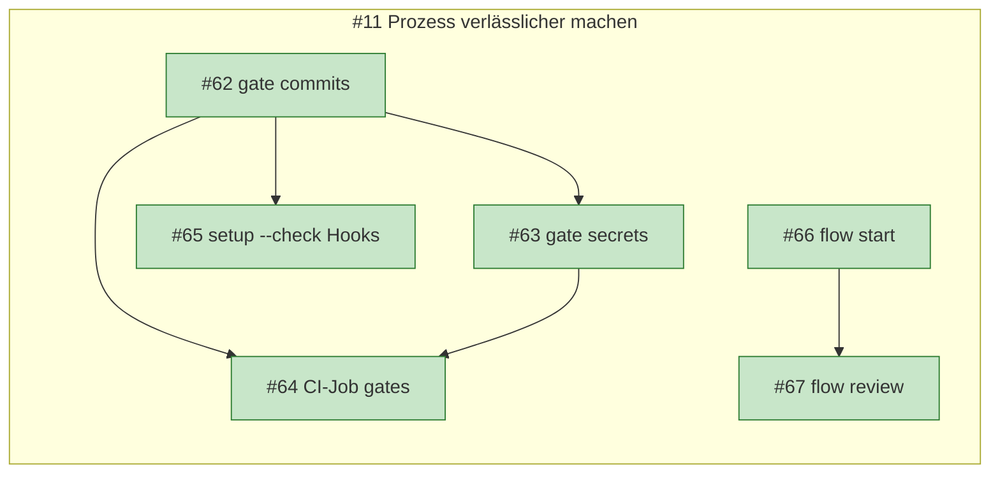

# 3. Dasselbe Beispiel mit kvasir

kvasir ist ein **optionales, rein lesendes** Terminal-Werkzeug (<https://github.com/comcy/kvasir>). Es ersetzt keinen Schritt aus Kapitel 2, es macht den **Stand sichtbar**: Wo steht das Feature, was blockiert, was kommt als Nächstes. Es schreibt nie nach GitHub und führt keine Übergänge aus (das bleibt bei `flow` und den Skills).

| Frage | ohne kvasir | mit kvasir |
| --- | --- | --- |
| Welche Tickets hängen unter #101? | `gh issue view 101`, Sub-Issues im Browser | `kvasir status '#101'` |
| Was blockiert #103? | Blocker-Beziehung im Issue lesen | steht in der Ausgabe (`blockiert von: #102 (open)`) |
| In welcher Phase ist das Feature? | Labels und Gedächtnis | Stepper aus Fakten (`[x] … [>] … [ ]`) |
| Passt das Label zur Wirklichkeit? | nicht prüfbar | Widerspruch wird angezeigt (`! Label sagt …`) |
| Wann ist was fällig? | im Issue-Text suchen | Termine aus Meilenstein, `Frist:`, `Geplant:` |
| Das große Bild über alle Features | Zettel, Kopf | `kvasir graph` (Mermaid oder HTML) |
| Worktrees für parallele Tickets | `git worktree add` von Hand | `kvasir tui`, Taste `n` |

## Einmalig: installieren und prüfen

```sh
curl -LsSf https://comcy.github.io/kvasir/install.sh | sh      # Linux/macOS
irm https://comcy.github.io/kvasir/install.ps1 | iex           # Windows (PowerShell)
kvasir doctor
```

**echt** (Ausschnitt, `kvasir doctor`):

```
✓ git 2.56.0
✓ gh installed
✓ gh logged in
! scope read:project missing (needed for board status)
    -> gh auth refresh -s read:project
✓ repos.toml readable
✓ local.toml readable
```

`!` ist eine Warnung (hier: Board-Status nicht lesbar, für diesen Workflow nicht nötig), `✗` wäre ein Fehler mit Exit-Code 1. `setup.py` führt kvasir als **empfohlen** (`scripts/setup.d/tools.tsv`): Fehlt es, gibt es nur einen Hinweis.

**Optional, empfohlen:** Das Repo im Bare-Layout klonen (`.bare/` plus ein Worktree je Branch), damit parallele Tickets in getrennten Ordnern laufen und nicht per `git stash` kollidieren:

```sh
kvasir setup https://github.com/comcy/comcy.github.io     # klont im Bare-Layout und registriert
kvasir tui                                                # Überblick, Taste n = neuer Worktree
```

## Die Phasen mit kvasir

### Phase S bis 3: ein Feature entsteht

Nach dem Anlegen von #101 und dem Schneiden der Tickets (Kapitel 2) zeigt kvasir den Stand aus den **Fakten** (Issue-Zustand, Blocker, PRs, Branches). Labels sind nur Hinweise:

**illustrativ** (Format wie in der echten Ausgabe):

```
$ kvasir status '#101'
#101 [offen] Tag-Übersicht: /tags/ mit Anzahl der Beiträge
    Schritte: [x] Setup (einmalig je Klon) -> [x] Eingang -> [x] Idee schärfen -> [x] Anforderungen festhalten -> [x] Arbeit schneiden -> [>] Bauen und prüfen -> [ ] Abschließen
Sub-Issues:
  #102 [in Arbeit] Tag-Übersicht: Tracer
      Schritte: [x] Branch -> [>] PR Draft -> [ ] Checks grün -> [ ] PR bereit -> [ ] gemergt
  #103 [blockiert] Sortierung und Verlinkung
      blockiert von: #102 (open)
      Schritte: [>] Branch -> [ ] PR Draft -> [ ] Checks grün -> [ ] PR bereit -> [ ] gemergt
  #104 [blockiert] Themes und Mobil
      blockiert von: #102 (open)
  #105 [blockiert] Doku und Abnahme
      blockiert von: #103 (open), #104 (open)
```

Die **Stepper-Zeile** der oberen Ebene entsteht aus `workflow/phases.tsv`: Jede Phase hat `done_when`-Detektoren (z. B. `subissues_exist`), kvasir prüft sie gegen den Zustand. Der Schritt `[>]` ist der erste nicht erledigte. Nicht Beobachtbares (Phase 6, `done_when` `-`) erscheint nicht.

### Phase 4: während des Bauens

Bei jedem Ticket zeigt der Stepper die Schritte der **Ticket-Ebene**: Branch, PR Draft, Checks grün, (Lokale Abnahme, Review, wenn die PR-Prüfliste sie enthält), PR bereit, gemergt. Das ersetzt das Blättern durch PR-Seiten.

**echt** (Ausschnitt `kvasir status '#11'` in diesem Repo):

```
#11 [offen] Idee: Prozess verlässlicher und nachvollziehbar machen (Hooks, Skripte, CI, Phasen als Daten)
    Schritte: [x] Setup (einmalig je Klon) -> [x] Eingang -> [>] Idee schärfen -> [ ] Anforderungen festhalten -> ...
Sub-Issues:
  #64 [erledigt] CI-Job gates: Commits und Diff jedes Pull Requests prüfen
      blockiert von: #62 (closed), #63 (closed)
      Schritte: [x] Branch -> [x] PR Draft -> [x] Checks grün -> [x] PR bereit -> [x] gemergt
      Vorgänger: #62, #63
  #67 [erledigt] flow review: Wechsel nach status:in-review
      blockiert von: #66 (closed)
      Schritte: [x] Branch -> [x] PR Draft -> [x] Checks grün -> [x] Review -> [x] PR bereit -> [x] gemergt
      Vorgänger: #66
```

Wichtig: Dort stand vorher bei mehreren erledigten Tickets `! Label sagt in-progress, Issue ist geschlossen`. Das ist der **Widerspruch zwischen Label und Fakten**, den kvasir ausweist. Er zeigte, dass nach dem Merge das Status-Label nicht entfernt worden war. Ursache gefunden, Labels bereinigt (siehe Kapitel 5).

**Gleichzeitig mehrere Tickets** (#103 und #104 nach Merge von #102): Mit dem Bare-Layout je Ticket ein Worktree (`kvasir tui`, `n`). Die TUI zeigt pro Branch Marker (`#103 ✓` Checks grün) und im Detail-Panel den Status-Block mit Stepper, Blockern und Hinweisen (`u` aktualisiert, `i` zeigt die Gesamtansicht aller PRs und Review-Anfragen).

### Der große Überblick: `kvasir graph`

```sh
kvasir graph --repo comcy/comcy.github.io > graph.md          # Mermaid in Markdown (GitHub rendert es)
kvasir graph --repo comcy/comcy.github.io --format html --out graph.html   # eigenständige HTML/SVG-Ansicht
kvasir graph '#101'                                            # nur ein Feature
kvasir graph --milestone "Sprint 12"                           # nur ein Meilenstein
```

Spuren = Features, Knoten = Tickets, Pfeile = Blocker, Farbe = Status. Standard: alles Offene plus die in den letzten 14 Tagen Erledigten, andere Repos als graue externe Knoten, Warnung ab etwa 40 Knoten. **echt** (aus den Daten dieses Repos, gekürzt und vereinfacht):



Termine erscheinen als Gantt-Block, **wenn** Tickets welche haben (Kapitel 4: Zeilen `Frist:` und `Geplant:`). Ohne Termine zeigt kvasir keine erfundene Zeitachse.

## Termine pflegen (optional)

Im Ticket-Text genügen zwei feste Zeilen, oder ein Meilenstein auf GitHub:

```
Geplant: 2026-10-12 – 2026-10-14
Frist: Ende Q4 2026
```

`Frist:` versteht ISO-Datum, `Ende Q<n> <jahr>`, `Ende <jahr>-<monat>`, `Ende <jahr>`. Bei Meilenstein **und** Zeile gewinnt das frühere Datum, beide werden angezeigt. kvasir meldet Hinweise (Ende vor Start, geplantes Ende nach der Frist, Blocker endet nach dem Start des abhängigen Tickets), korrigiert aber nichts.

## Konfiguration im Repo: `kvasir.toml` (optional)

Ohne Datei nutzt kvasir die Phasen aus `workflow/phases.tsv`, die Detektoren aus `workflow/detectors.tsv` und eingebaute Standardwerte. Eine `kvasir.toml` im Repo-Wurzelverzeichnis ist nur für **geteilte Überschreibungen** nötig:

```toml
# kvasir.toml: Branch-Vorlagen für alle Klone, optional abweichende Phasen
[branches]
patterns = ["feature/{id}-{slug}", "fix/{id}-{slug}"]

[[phases]]                      # überschreibt workflow/phases.tsv (sonst weglassen)
name = "Idee schärfen"
done_when = ["openspec_change_exists"]
```

- `kvasir init` zeigt zuerst den Diff und überschreibt nie still. `kvasir doctor` prüft die Datei (unbekannte Detektoren, fehlende Pflichtfelder, Widersprüche zu `repos.toml`).
- Vorrang: **lokal** (`~/.config/kvasir/local.toml`, `repos.toml`) vor **Repo** (`kvasir.toml`) vor **Standard**.
- Die Dateien enthalten nur Namen aus dem festen Vokabular, **nie Code**: kvasir wertet aus, die Datei beschreibt.

## Grenzen (ehrlich)

- Nur lesend. Kein Label setzen, kein Branch anlegen: Das tut `flow start`/`flow review`.
- Das Vokabular der Detektoren ist fest. Unbekannte Namen erscheinen als "unbekannt" und `doctor` meldet sie.
- Einzelne Detektoren sind Heuristiken: `openspec_archived` (kein aktiver Change und mindestens ein archivierter), `pr_checklist` (alle gefundenen Kästchen mit dem Text abgehakt).
- `level` (Pflicht/optional) wertet kvasir noch nicht aus: Die optionale Phase 4b kann deshalb als "aktuell" vor Phase 5 stehen.
- Azure DevOps: Status, Beziehungen und Termine aus Work Items, gegen ein echtes Azure-Repo noch nicht geprüft.
- Windows: noch nicht manuell geprüft (kvasir-Ticket #21).
