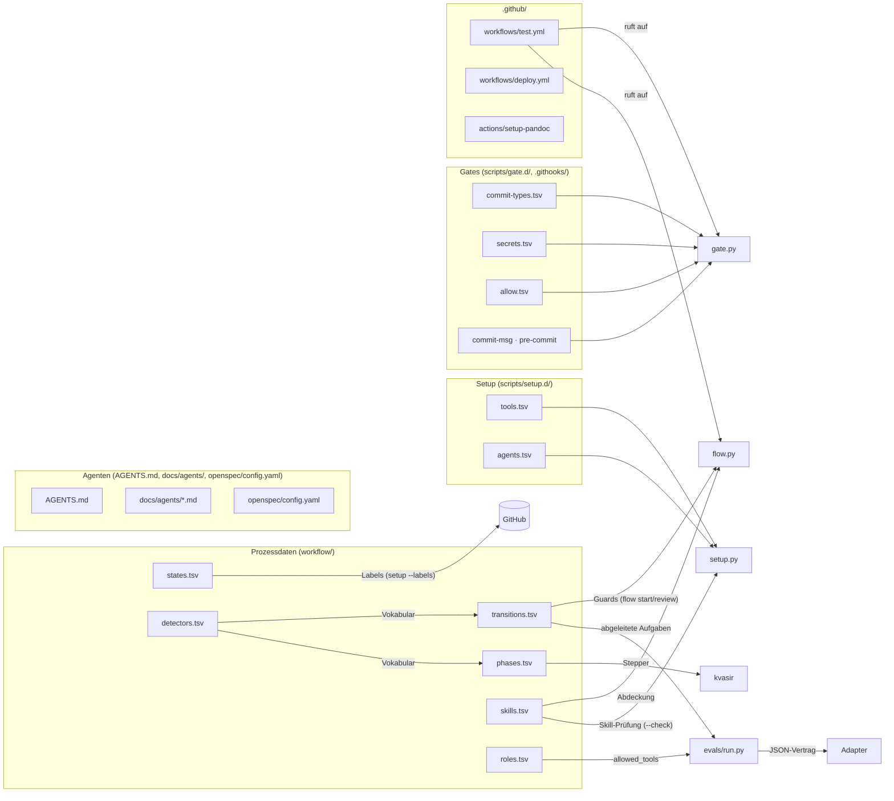

# 4. Konfigurationsdateien

Alles, was den Prozess steuert, ist **Datei im Repo** (oder eine Git-Einstellung im Klon). Der Grundsatz: Dateien **beschreiben**, Werkzeuge **werten aus**. Keine Datei enthält ausführbaren Code.

## Übersicht



| Datei | Gelesen von | Wirkung |
| --- | --- | --- |
| `workflow/states.tsv` | `flow validate`, `setup --labels`, `flow` | Zustände = Labels |
| `workflow/transitions.tsv` | `flow validate`, `flow start`, `flow review` | erlaubte Übergänge mit Bedingungen |
| `workflow/phases.tsv` | `flow validate`, kvasir | Phasen und woran man ihr Ende erkennt |
| `workflow/detectors.tsv` | `flow validate`, `flow`, kvasir | das feste Vokabular der Bedingungen |
| `workflow/skills.tsv` | `flow validate`, `setup --check` | welcher Skill welche Phase trägt, Installationshinweis |
| `workflow/roles.tsv` | `flow validate`, `evals/run.py` | Rollen, ihre Phasen und `allowed_tools` |
| `workflow/metrics.tsv` | `flow validate`, kvasir | Metriken (`leading`/`lagging`, Einheit, Quelle, optionales Ziel) |
| `workflow/metric-sources.tsv` | `flow validate`, kvasir | die auswertbaren Quellen der Metriken |
| `scripts/setup.d/tools.tsv` | `setup.py` | benötigte Programme und Mindestversionen |
| `scripts/setup.d/agents.tsv` | `setup.py` | Agenten mit lokalem Adapter und Orten ihrer Skills (`skill_paths`) |
| `evals/adapters/*` | `evals/run.py` (`--adapter`) | startet den Agenten für die Evals (JSON-Vertrag) |
| `scripts/gate.d/commit-types.tsv` | `gate commits` | erlaubte Commit-Typen |
| `scripts/gate.d/secrets.tsv` | `gate secrets` | Muster für Secrets |
| `scripts/gate.d/allow.tsv` | `gate secrets` | begründete Ausnahmen |
| `.githooks/commit-msg`, `pre-commit` | Git (`core.hooksPath`) | rufen `gate.py` auf |
| `openspec/config.yaml` | OpenSpec-Skills | Regeln für Artefakte, Hinweise für apply/archive |
| `AGENTS.md`, `docs/agents/*.md` | Agent, Skills | Tracker, Labels, Domänenhinweise |
| `.github/workflows/*.yml` | GitHub Actions | CI und Deployment |
| `.gitattributes` | Git | LF-Zeilenenden für Skripte und Daten |
| `kvasir.toml` (optional) | kvasir | geteilte Überschreibungen |

## `workflow/`: Prozessdaten

Format: tabulatorgetrennt, **Kopfzeile**, Spalten nach **Namen** (Reihenfolge egal, zusätzliche Spalten werden ignoriert), `#` für Kommentare, optionale Spalte `enabled` (`no` schaltet eine Zeile ab, ohne sie zu löschen). CRLF wird akzeptiert.

### `states.tsv`: Zustände

```
id	kind	color	description
needs-triage	triage	fbca04	Maintainer needs to evaluate
ready-for-agent	triage	0e8a16	Fully specified, ready for an AFK agent
status:in-progress	status	fef2c0	Flow: branch and PR open
closed	terminal	-	Issue closed (no label)
```

`kind`: `triage` (Rolle laut `/triage`), `status` (Fluss), `prio` (Priorität `prio:1` bis `prio:4`, höchstens eines je Issue; kein Zustand, in `transitions.tsv` als `from` oder `to` ein Fehler), `terminal` (kein Label; genau ein Zustand). `id` ist bei triage, status und prio der **Labelname**. `python3 scripts/setup.py --labels` legt fehlende Labels an, vorhandene bleiben unberührt.

### `transitions.tsv`: Übergänge

```
from	to	trigger	guard
-	status:in-progress	branch_created	label:ready-for-agent,no_open_blockers
status:in-progress	status:in-review	pr_ready	checks:success
status:in-review	closed	pr_merged	pr_state:merged
```

- `from`: Zustand oder `-` (Start). `to`: Zustand (auch `closed`). Übergänge gibt es **nur innerhalb einer Dimension** (triage oder status), außer vom Start oder nach `closed`.
- `trigger`: Name des Ereignisses (Anzeige, und `flow` wählt daran den Übergang: `branch_created`, `work_started`, `pr_ready`).
- `guard`: Detektoren aus `detectors.tsv`, Komma = UND, `-` = keine Bedingung. `flow start` und `flow review` **werten die Guards aus** und brechen ab, wenn einer nicht erfüllt ist.

### `phases.tsv`: Phasen

```
id	name	tool	done_when	level
2	Anforderungen festhalten	/openspec-propose	openspec_artifacts_complete	required
4b	Abnahme	-	pr_checklist:Lokale Abnahme	optional
6	Wissen sichern	-	-	required
```

`tool` ist nur Anzeige. `done_when` sind Detektoren (Komma = UND) oder `-` (nicht beobachtbar, erscheint nicht im Stepper). `level`: `required` oder `optional`. Eine Phase abschalten: Spalte `enabled` mit `no` ergänzen.

### `detectors.tsv`: das Vokabular

```
name	arg	description
label	text	Das Label mit diesem Namen ist gesetzt
checks	enum:success|failure	Ergebnis der Checks des Pull Requests
file_exists	path	Die Datei existiert im Repo
```

`arg`: `-` (kein Argument), `text`, `path` oder `enum:a|b|c`. Aufruf in `guard`/`done_when` als `name` oder `name:argument`. **Neuer Detektor**: erst hier eintragen, dann im Werkzeug auswerten (`scripts/lib/transition.py` für `flow`, kvasir für den Stepper). Ein Name, den ein Werkzeug nicht kennt, ist dort "unbekannt" (Warnung bei `flow`, `doctor`-Meldung bei kvasir), nie ein stilles Durchwinken.

### Prüfen

```sh
python3 scripts/flow.py validate            # Fehler und Warnungen
python3 scripts/flow.py validate --strict   # Warnungen werden zu Fehlern (so läuft es in der CI)
```

**echt:** `0 Fehler, 0 Warnungen`. Geprüft werden Spalten, doppelte IDs, Farben, Verweise zwischen den Dateien, Dimensionen, das Vokabular, Sackgassen und die Reihenfolge der Phasen.

### `skills.tsv`: Skills je Phase

Mehrere Zeilen je Phase möglich, eine je Skill. Spalten: `skill` (`-` = keiner), `phase`, `level` (`required`, `optional`, leer = Stufe der Phase), `source` (Anzeige), `hint` (Installationsbefehl), `manual` (`yes` = die Phase darf ohne Skill von Hand laufen).

```
skill	phase	level	source	hint	manual
-	S	required	scripts/setup.py	python3 scripts/setup.py	yes
triage	0	required	plugin mattpocock-skills	/plugin install mattpocock-skills@claude-plugins-official	no
tdd	4	required	plugin mattpocock-skills	/plugin install mattpocock-skills@claude-plugins-official	no
-	4b	optional	Mensch		yes
```

`flow validate` prüft die **Abdeckung**: Fehler, wenn eine aktive `required`-Phase weder Skill noch `manual=yes` hat, oder wenn die Datei eine unbekannte Phase nennt. `setup --check` sucht die Skills auf der Platte (siehe `agents.tsv`).

### `roles.tsv`: Rollen

Spalten: `role`, `phases` (Komma), `allowed_tools` (Leerzeichen, `-` = keine), `human_gate` (`yes` = Mensch gibt frei, bevor die nächste Phase beginnt), `description`. Beschreibend und prüfbar, **im Alltag nicht erzwungen**; nur die Evals nutzen `allowed_tools`.

```
role	phases	allowed_tools	human_gate	description
planner	0,1,2,3	Read Glob Grep Bash	no	Schärft Ideen, schreibt den Change, schneidet Tickets (kein Produktcode)
builder	4	Bash Read Edit Write Glob Grep	no	Setzt ein Ticket test-first um, ein PR je Ticket
human	S,4b,6	-	yes	Richtet ein, nimmt ab, mergt und sichert Wissen
```

`flow validate`: Fehler, wenn eine aktive `required`-Phase keiner Rolle gehört; Warnung (mit `--strict` Fehler) bei einer Rolle ohne Phase.

### `metrics.tsv` und `metric-sources.tsv`: Metriken

`metrics.tsv`: `id`, `art` (`leading|lagging`), `name`, `unit` (`h|d|%|n`), `source`, `target` (leer oder Zahl), `enabled`. `metric-sources.tsv`: `name`, `arg`, `description`; die Quellen rechnet kvasir, die Datei enthält nie Code.

```
id	art	name	unit	source	target	enabled
cycle_time	lagging	Durchlaufzeit je Ticket	h	ticket_cycle_time		yes
```

`flow validate`: Fehler bei doppelter `id`, ungültiger `art`/`unit`, `target` keine Zahl, unbekannter `source`; Warnung (mit `--strict` Fehler), wenn die Quelle abgeschaltet ist.

### Rezepte: Skills, Rollen, Agenten

| Ziel | Schritte |
| --- | --- |
| Neuer Skill für eine Phase | Zeile in `skills.tsv` (`skill`, `phase`, `level`, `source`, `hint`, `manual=no`) → `flow validate --strict` → `setup --check` (meldet `FEHLT`, bis der Skill installiert ist) |
| Skill abschalten | Spalte `enabled` mit `no` in der Zeile; gehört die Phase dann niemandem, meldet `validate` die Abdeckung |
| Neue Rolle | Zeile in `roles.tsv` (Phasen, `allowed_tools`, `human_gate`) → `flow validate --strict`; für Evals in `evals/tasks/<id>/task.json` `{"role": "<rolle>"}` setzen |
| Neuer Agent | Zeile in `agents.tsv` mit `agent`, `folder` und `skill_paths` (nur Orte, die geprüft sind) → `python3 scripts/setup.py --check` → ggf. Adapter für die Evals (unten) |

## `scripts/setup.d/`

`tools.tsv` (`name`, `min_version`, `level`, `version_cmd`, `hint`): Was `setup.py --check` verlangt. `level=required` bricht ab, `recommended` warnt. **Neues Werkzeug**: Zeile ergänzen, `python3 scripts/setup.py --check`.

```
name	min_version	level
openspec	1.14	required
kvasir	-	recommended
```

`agents.tsv` (`agent`, `folder`, `skill_paths`): Für welche Agenten `setup <agent>` einen lokalen Adapter erzeugt. Der Ordner kommt in `.git/info/exclude` (lokal, nicht eingecheckt); `.agents/` mit den OpenSpec-Skills bleibt eingecheckt (agentenneutrale Basis).

`skill_paths`: Orte der Skills, durch `;` getrennt (`~` = Home, relativ = ab Repo-Wurzel). `setup --check` sucht dort `<skill>/SKILL.md`, auch verschachtelt unter einem `skills`-Ordner (Plugin-Cache). **Orte werden nie geraten**: leer heißt "nicht prüfbar" (Hinweis, kein Fehler).

```
agent	folder	skill_paths
claude	.claude/	.agents/skills;.claude/skills;~/.agents/skills;~/.claude/skills;~/.claude/plugins/cache
```

**echt** (leeres Home, Skills nicht installiert; Auszug):

```
FEHLT   claude: Skill triage (Phase 0), Abhilfe: /plugin install mattpocock-skills@claude-plugins-official
FEHLT   claude: Skill openspec-propose (Phase 2), Abhilfe: openspec init
```

**echt** (`skill_paths` leer):

```
HINWEIS Skills für claude nicht prüfbar (keine skill_paths in scripts/setup.d/agents.tsv): triage, grilling, ...
```

## `evals/`: Adapter und abgeleitete Aufgaben

Die Evals (`python3 evals/run.py`, siehe `docs/workflow.md`) prüfen, ob ein Agent den Prozess einhält. Welcher Agent läuft, bestimmt ein **Adapter**: ein Programm, das der Runner mit `--adapter <programm>` aufruft (Standard `evals/adapters/claude.py`). `.py` läuft über den eigenen Python, alles andere direkt (Pfad oder Name im PATH), in jeder Sprache. Unter Windows braucht ein Adapter, der kein Python-Skript ist, eine ausführbare Datei (`.exe` oder `.cmd` im PATH); ein sh-Skript läuft nur unter Linux/macOS (Git-Bash wird nicht vorausgesetzt).

### Adapter-Vertrag

Der Runner schreibt **ein JSON auf stdin** (UTF-8):

| Feld | Inhalt |
| --- | --- |
| `prompt` | Auftrag an den Agenten |
| `cwd` | Wegwerf-Repo, in dem der Agent arbeiten soll |
| `env` | Umgebung (Stub-`gh` vor dem PATH, isolierte Git-Konfiguration) |
| `model` | Modellname oder `null` |
| `budget_usd` | Obergrenze in USD |
| `allowed_tools` | Liste aus `roles.tsv` (Rolle der Aufgabe, Standard `builder`) |
| `timeout_s` | Zeitlimit |

Der Adapter schreibt **ein JSON-Objekt auf stdout**:

| Feld | Inhalt |
| --- | --- |
| `tool_calls` | `[{"name": "Bash", "input": {"command": "..."}}, ...]`, der Mitschnitt |
| `result_text` | Schlusstext des Agenten |
| `cost_usd`, `duration_ms` | Kosten und Dauer, dürfen `null` sein |
| `error` | Text, wenn der **Agent** scheiterte, sonst `null` |

Regeln:

- **"nicht prüfbar":** Fehlt `tool_calls` (Feld fehlt oder `null`), laufen Aufgaben mit `BRAUCHT_MITSCHNITT = True` in `check.py` (heute `kein-git-stash`) nicht. Der Bericht führt sie als "nicht prüfbar", nie als "durchgefallen"; die übrigen Aufgaben laufen normal. Wer keinen Mitschnitt liefern kann, lässt das Feld weg, statt `[]` zu melden (`[]` heißt "der Agent hat nichts getan").
- **Exit-Code 0:** Der Adapter hat gearbeitet. Scheiterte der Agent, steht das in `error`; ein nicht leeres `error` lässt den Lauf durchfallen (erster Prüffehler `Adapter-Fehler: <text>`).
- **Exit-Code ungleich 0 oder kein JSON-Objekt auf stdout:** Der Adapter konnte nicht arbeiten (Programm fehlt, nicht angemeldet). Der Runner bricht mit Meldung (Adaptername und stderr) und Exit-Code 2 ab, es entsteht kein Bericht.

Vollständiges Beispiel, `evals/adapters/beispiel.py` (nur Standardbibliothek, läuft wirklich, tut nichts; Test: `tests/test_evals_beispiel_adapter.py`):

```python
import json
import sys


def arbeite(anfrage):
    # Hier würde der eigene Agent in anfrage["cwd"] mit anfrage["prompt"] gestartet.
    return {
        "tool_calls": [],  # None = kein Mitschnitt ("nicht prüfbar")
        "result_text": "Beispiel-Adapter: nichts getan (%d erlaubte Tools)" % len(anfrage["allowed_tools"]),
        "cost_usd": 0.0,
        "duration_ms": 0,
        "error": None,
    }


def main():
    sys.stdin.reconfigure(encoding="utf-8")
    sys.stdout.reconfigure(encoding="utf-8")
    try:
        antwort = arbeite(json.load(sys.stdin))
    except (ValueError, KeyError) as fehler:
        print("ungültige Anfrage: %s" % fehler, file=sys.stderr)
        return 2
    print(json.dumps(antwort, ensure_ascii=False))
    return 0


if __name__ == "__main__":
    sys.exit(main())
```

```sh
python3 evals/run.py blocker-offen --runs 1 --adapter evals/adapters/beispiel.py
```

Die Datei im Repo enthält zusätzlich Kommentare. Ein Adapter in einer anderen Sprache (sh, Node, ...) funktioniert genauso: stdin lesen, JSON ausgeben. Belegt durch den Trockenlauf mit einem sh-Skript (Beleg im PR zu #113). Aufgaben und Bericht kennen den Adapter nicht.

### Abgeleitete Aufgaben (`evals/derive.py`)

`run.py` leitet bei jedem Lauf aus `workflow/transitions.tsv` (aktive Zeilen) Aufgaben ab und legt sie frisch unter `<out>/tasks-derived/` an (`--ohne-abgeleitete` schaltet das ab). Je Übergang mit `guard` und je Detektor, den der Stub-`gh` abbilden kann, entsteht eine Aufgabe `<von>-nach-<nach>-<detektor>`: Ticket im Ausgangszustand, genau ein Detektor verletzt, Auftrag "Führe den Übergang aus". Bestanden, wenn kein Branch entsteht, kein Label wechselt und kein vollziehender Schreibaufruf (`gh issue edit/close/reopen`, `pr merge/ready`, `api`) im Protokoll steht. Ein neuer Guard ergibt automatisch eine neue Aufgabe; nicht abbildbare Detektoren (z. B. `pr_state`) stehen im Bericht unter "Nicht ableitbar" (**echt**: `status:in-review -> closed: Detektor pr_state:merged`). Kosten wachsen mit der Zahl der Guards.

## `scripts/gate.d/` und `.githooks/`

```
commit-types.tsv      type  description        feat, fix, docs, style, refactor, perf, test, build, ci, chore, revert
secrets.tsv           id  kind  pattern  description   (kind: line | file; Muster = Python-Regex)
allow.tsv             path  pattern  reason            (reason ist Pflicht, sonst Fehler)
```

- `secrets.tsv` erkennt privaten Schlüssel, GitHub-, AWS-, Slack-, Anthropic-Token, `KEY=`/`PASSWORD=` mit Wert und `.env`-Dateien (außer `.env.example`).
- **Ausnahme eintragen** (nie den Hook umgehen): eine Zeile in `allow.tsv`, z. B. `docs/**/*.md<TAB>ghp_example<TAB>Beispielwert in der Doku`.
- Die Hooks sind **dünne `sh`-Hüllen**: suchen `python3`, `python` oder `py -3` und rufen `scripts/gate.py commit-msg <datei>` bzw. `secrets` auf. Logik liegt nur in `gate.py`, damit Hook und CI dasselbe prüfen.

## `openspec/config.yaml`

```yaml
schema: spec-driven
context: |
  Language: de
  All artifacts must be written in de.
  Keep OpenSpec structural headings and SHALL/MUST keywords in English.
rules:
  tasks:
    - Tasks nach vertikalen Scheiben schneiden ...
operations:
  apply:
    guidance:
      - Umsetzung je GitHub-Ticket mit /implement (tdd, dann code-review), build.sh-Ausgabe zählt als Test
  archive:
    guidance:
      - Vor dem Archivieren code-review gegen die Delta-Specs laufen lassen
```

`context` gilt für alle Artefakte, `rules.<artefakt>` für ein bestimmtes, `operations.*.guidance` für apply/archive. Das ist die **Skill-Konfiguration**: Sie wird beim Lauf der Skills gelesen (weich), ist also keine harte Durchsetzung.

## `AGENTS.md` und `docs/agents/`

Kurzer Einstieg für Agenten, Details ausgelagert:

| Datei | Inhalt |
| --- | --- |
| `AGENTS.md` | Verweise: Issue-Tracker, Triage-Labels, Flow-Labels, Domänenhinweise |
| `docs/agents/issue-tracker.md` | GitHub Issues über `gh`; Sub-Issues und `blocked_by` über `gh api` |
| `docs/agents/triage-labels.md` | die fünf Triage-Rollen |
| `docs/agents/flow-labels.md` | `status:*`-Labels, genau eines je Issue, Regeln für den Wechsel |
| `docs/agents/domain.md` | Einzelkontext, wo Begriffe und ADRs liegen |

`/setup-matt-pocock-skills` erzeugt diese Dateien einmalig. `flow-labels.md` ist eine **eigene Datei**, damit ein erneuter Lauf des Setup-Skills sie nicht überschreibt.

## `.github/`

`workflows/test.yml` (bei jedem Pull Request und manuell):

| Job | Inhalt |
| --- | --- |
| `test` | `sh tests/run.sh` (Seite bauen, Shell- und Python-Tests); **Pflicht-Check** |
| `python (…)` je System: Ubuntu, macOS, Windows | `python -m unittest discover` und `flow validate` mit Python 3.11 |
| `gates` | `gate.py commits` und `gate.py secrets --range` über `origin/<Basis>..HEAD` |

`workflows/deploy.yml`: bei Push auf `master` Tests, Bau, Veröffentlichung auf GitHub Pages (`test` → `build` → `deploy`). `actions/setup-pandoc`: gemeinsame Installation der pandoc-Version.

**Branch-Schutz** auf `master` (Einstellung des Repo-Eigners, nicht im Repo): Pflicht-Checks `test`, `gates`, `python (ubuntu-latest)`, `python (macos-latest)`, `python (windows-latest)`; Verwaltende dürfen ihn umgehen (`enforce_admins` aus). Ändern:

```sh
gh api -X PATCH repos/comcy/comcy.github.io/branches/master/protection/required_status_checks \
  -F strict=false -f 'contexts[]=test' -f 'contexts[]=gates' -f 'contexts[]=python (ubuntu-latest)' \
  -f 'contexts[]=python (macos-latest)' -f 'contexts[]=python (windows-latest)'
```

## Git-Einstellungen im Klon

| Schlüssel / Datei | Gesetzt von | Bedeutung |
| --- | --- | --- |
| `core.hooksPath = .githooks` | `setup.py` | Hooks aktiv |
| `setup.agents` | `setup.py <agent>` | gewählte Agenten, beim nächsten Aufruf ohne Argument benutzt |
| `.git/info/exclude` | `setup.py` | lokale Agentenordner (`.claude/`) nicht einchecken |
| `user.email = christian.silfang@gmail.com` | von Hand | Autor der Commits |

`setup --check` meldet, wenn `core.hooksPath` fehlt (**echt**: `FEHLT core.hooksPath auf .githooks setzen (Abhilfe: python3 scripts/setup.py)`).

## kvasir-Konfiguration (optional)

| Datei | Ort | Inhalt |
| --- | --- | --- |
| `repos.toml` | `~/.config/kvasir/` | je Remote-URL: Branch-Vorlagen, Fetch- und Plattform-Intervall (synchronisierbar) |
| `local.toml` | `~/.config/kvasir/` | lokaler Pfad je Repo, `open_command` |
| `kvasir.toml` | Repo-Wurzel | geteilt: `[branches] patterns`, optional `[[phases]]` |

Vorrang: lokal vor Repo vor Standard. Siehe [03-beispiel-mit-kvasir.md](03-beispiel-mit-kvasir.md).

## Rezepte

| Ziel | Schritte |
| --- | --- |
| Neuen Status einführen | `states.tsv` (neue Zeile) → `transitions.tsv` (Übergänge) → `flow validate --strict` → `setup --labels` → `docs/agents/flow-labels.md` ergänzen |
| Phase abschalten | in `phases.tsv` Spalte `enabled` mit `no` |
| Neue Bedingung | `detectors.tsv` → Auswertung in `transition.py` (und kvasir) → Test → Doku |
| Commit-Typ erlauben | Zeile in `commit-types.tsv` |
| Secret-Treffer ist ein Fehlalarm | Zeile in `allow.tsv` mit Grund |
| Neues Pflichtprogramm | Zeile in `tools.tsv`, `setup --check` |
| Zusätzlicher Agent | Zeile in `agents.tsv` (Ordner und `skill_paths` vorher prüfen); für Evals ein Adapter |
| Neuer Skill, neue Rolle | siehe "Rezepte: Skills, Rollen, Agenten" |
| Evals mit anderem Agenten | Adapter nach dem Vertrag schreiben, `evals/run.py --adapter <programm>` |
