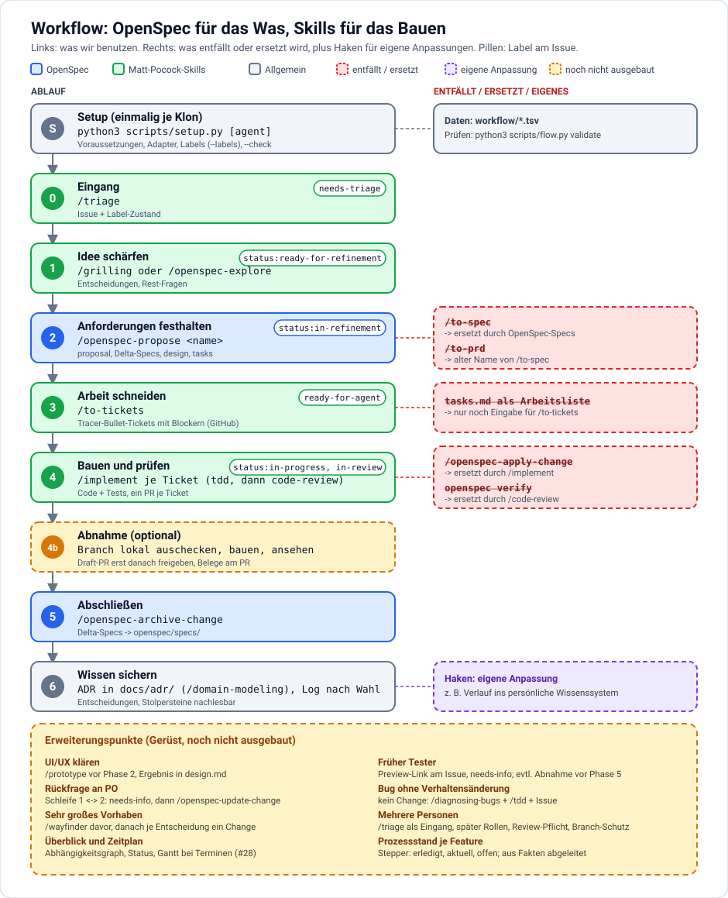

# Entwicklungs-Workflow (v0)

Stand: 2026-10-04. **v0, noch nicht an einem echten Change erprobt.** Wird nach dem ersten Change (Timeline) korrigiert.

Aufbau:
- **Teil A** ist projektunabhängig und generisch. Er soll später in ein eigenes Entwickler-Repo wandern (Setup-Skript wie `setup-matt-pocock-skills`).
- **Teil B** sind die Eigenheiten dieses Repos.
- **Teil C** sind persönliche Anpassungen ("user custom"). Sie hängen als Haken an Phasen aus Teil A, gehören aber nie in Teil A selbst.

## Teil A: Generischer Ablauf

### Voraussetzungen

Was jede Person installiert haben muss, bevor der Ablauf funktioniert:

| Voraussetzung | Wofür | Installation | Prüfen |
| --- | --- | --- | --- |
| `git` und ein GitHub-Repo | Versionsverwaltung, Remote | Paketmanager | `git --version` |
| GitHub CLI `gh`, eingeloggt | Issues, PRs, `/triage`, `/to-tickets` | <https://cli.github.com>, dann `gh auth login` | `gh auth status` |
| Node.js ab 20.19 | Laufzeit für OpenSpec | <https://nodejs.org> oder Paketmanager | `node --version` |
| `pnpm` (oder `npm`) | installiert OpenSpec | Paketmanager; `pnpm` einmalig `pnpm setup` | `pnpm --version` |
| OpenSpec CLI | Specs und Changes | `pnpm add -g @fission-ai/openspec@latest` (oder `npm i -g`) | `openspec --version` (hier 1.14.0) |
| KI-Agent mit Skill-Unterstützung | führt die Skills aus (hier Claude Code) | siehe Agent-Doku | |
| Matt-Pocock-Skills | `grilling`, `triage`, `to-tickets`, `implement`, `tdd`, `code-review` u. a. | Plugin über den Marketplace: `/plugin install mattpocock-skills@claude-plugins-official` (hier 1.2.3) | `/plugin` |

Projektspezifische Werkzeuge (z. B. Build-Tools) stehen in Teil B.

### Ablauf



Leitidee: **OpenSpec hält fest, *was* gelten soll (Anforderungen als Specs). Issues, TDD und Review erledigen *das Bauen*.** Zwei Quellen der Wahrheit vermeiden: Specs beschreiben Verhalten, Issues beschreiben Arbeit.

| Phase | Werkzeug | Ergebnis |
| --- | --- | --- |
| 0. Eingang | Issue anlegen, `/triage` | Triage-Zustand (`needs-triage`, `needs-info`, `ready-for-agent`, `ready-for-human`, `wontfix`) |
| 1. Idee schärfen | `/grilling` oder `/openspec-explore` | Entscheidungen, Rest-Fragen |
| 2. Anforderungen festhalten | `/openspec-propose <name>` | `openspec/changes/<name>/`: proposal, Delta-Specs, design, tasks |
| 3. Arbeit schneiden | `/to-tickets` aus dem Change | Tracer-Bullet-Tickets mit Blockern auf GitHub |
| 4. Bauen und prüfen | `/implement` je Ticket (treibt `tdd`, endet mit `code-review`) | Code + Tests, ein PR je Ticket, `tasks.md` abhaken |
| 5. Abschließen | `/openspec-archive-change` | Delta-Specs fließen in `openspec/specs/` |
| 6. Wissen sichern | Entscheidungen als ADR in `docs/adr/` (`/domain-modeling`), Verlauf in einem Log, Ort frei wählbar | Entscheidungen, Stolpersteine nachlesbar |

Status am Issue (zweite Label-Dimension, `status:ready-for-refinement`, `status:in-refinement`, `status:in-progress`, `status:in-review`): `docs/agents/flow-labels.md`. Die Skills setzen sie nicht, sie gelten als Anweisung.

Rollen der Skills: **OpenSpec ist die Spec** (Verhalten, dauerhaft in `openspec/specs/`). `/to-spec` wird deshalb **nicht** benutzt, es würde eine zweite Spec als Issue anlegen. `/to-tickets` ist das Bindeglied: Es schneidet den Change in Arbeit, die Issues referenzieren den Change-Namen.

Regeln:
- Ändert sich ein Verhalten während des Bauens, zuerst den Change aktualisieren (`/openspec-update-change`), dann Code. Sonst driftet die Spec.
- `/openspec-propose` plant nur und stoppt. Bauen startet immer eine neue, ausdrückliche Anfrage.
- Bei sehr großem Vorhaben (mehr als eine Session) vorher `/wayfinder`: Karte aus Entscheidungs-Tickets, danach je Entscheidung ein Change.
- Unsicher, welcher Skill passt: `/ask-matt`.
- Reiner Bugfix ohne Verhaltensänderung braucht keinen Change: `diagnosing-bugs` + `tdd` + Issue.
- Commit-Konvention und Secret-Scan vor dem Staging festlegen (Teil B/C).

### Eigene Anpassungen

Jede Person darf Phasen um eigene Schritte ergänzen (Haken), ohne den generischen Ablauf zu ändern. Regel: Der Haken benennt die Phase, nach der er läuft, und beschreibt den Schritt. Beispiele für Haken: Verlauf in ein persönliches Wissenssystem schreiben (nach Phase 6), eigene Branch-Regeln (Phase 4), Benachrichtigungen. Die konkreten Haken stehen in Teil C.

### Setup-Checkliste (Basis für ein späteres Skript)

1. Voraussetzungen (Tabelle oben) erfüllen.
2. Git-Repo mit GitHub-Remote.
3. `/setup-matt-pocock-skills`: `AGENTS.md` (oder `CLAUDE.md`), `docs/agents/{issue-tracker,triage-labels,domain}.md`.
4. `openspec init --tools agents --language <de|en>` -> `openspec/` und `.agents/skills/` (6 OpenSpec-Skills, keine Commands).
5. `openspec/config.yaml`: `rules.tasks` und `operations.apply|archive.guidance` auf den Workflow zeigen lassen (Beispiel: Teil B).
6. Dieses Dokument ins Projekt legen.
7. Eigene Haken einrichten (Teil C).

Hinweis zur Skill-Erkennung: Claude Code sucht Projekt-Skills in `.claude/skills/`, nicht in `.agents/skills/` (bestätigt: `/openspec-propose` blieb unbekannt). Lokal verlinken, ohne `.claude/` einzuchecken (der Symlink selbst ist **noch nicht getestet**):

```
mkdir -p .claude/skills && for d in .agents/skills/openspec-*; do ln -s ../../$d .claude/skills/$(basename $d); done
echo '.claude/' >> .git/info/exclude
```

## Teil B: Dieses Repo

- Stack: POSIX-Shell + pandoc, kein Testframework. "Test" heißt hier: `sh build.sh` läuft sauber, erwartete Dateien in `public/` existieren, Stichproben per `grep`. Ein Check pro Logik, kein Framework (ponytail).
- Zusätzliche Voraussetzung: `pandoc` (Arch: `sudo pacman -Syu pandoc-cli`).
- Sprache der Specs: Deutsch, Strukturüberschriften und SHALL/MUST englisch (`openspec/config.yaml`).
- Commits: Conventional Commits, Secret-Scan vor dem Staging.
- Geplante Changes: `timeline-startseite` (PR 1), `zweisprachig-de-en` (PR 2). Vorlage: `docs/plans/zweisprachig-und-timeline.md`.
- Beobachtungen zur Einrichtung:
  - `openspec init --tools claude` legte `.claude/skills/` (6 Skills) **und** `.claude/commands/opsx/` (6 Commands) an, dieselben sechs Abläufe doppelt. `--tools agents` legt nur `.agents/skills/` an (6 Skills, keine Commands). Wir nutzen `agents`, `.claude/` ist entfernt.
  - Die Skill-Namen ändern sich damit: `/opsx:propose` wird zu `/openspec-propose`, `/opsx:archive` zu `/openspec-archive-change` usw.
  - `openspec init` hat `AGENTS.md` nicht verändert.
  - Im Standardprofil sind `new`, `continue`, `ff`, `bulk-archive`, `verify`, `onboard` nicht aktiv (`openspec config profile`). `verify` wäre die OpenSpec-eigene Variante von Phase 4.
  - Plugin `mattpocock-skills` 1.2.3 enthält alles nötige. Umbenannt: `to-issues` -> `to-tickets`, `to-prd` -> `to-spec`. `triage`, `to-tickets`, `to-spec`, `implement`, `wayfinder`, `ask-matt` sind nur per Eingabe aufrufbar (`disable-model-invocation`) und stehen deshalb nicht in der Skill-Liste des Modells.
  - Die Kopie von `setup-matt-pocock-skills` unter `~/.claude/skills/` ist älter und spricht noch von `to-issues`/`to-prd`.

## Teil C: Eigene Anpassungen (Chris)

Haken an den generischen Phasen. Nur persönlich, nicht Teil des generischen Ablaufs:

| Nach Phase | Haken |
| --- | --- |
| Setup | Repo als Bare-Repo mit Git-Worktrees auschecken (ein Worktree je Branch) |
| 4 (Commit) | Commits als Conventional Commits mit festem Autor, Secret-Scan vor dem Staging (globale Regeln) |
| 6 | Verlauf und Referenz zusätzlich ins persönliche Wissenssystem (Vault, `Projects/<name>/`: Plan, Log) schreiben |

## Erweiterungspunkte (bewusst noch nicht ausgebaut)

Das Phasenmodell ist ein Gerüst, keine Vollständigkeit. Wo Lücken später gefüllt werden:

- **UI/UX klären:** vor Phase 2 `prototype` (HTML-Varianten zum Anschauen), Ergebnis in `design.md` des Changes. Heute für die Timeline nicht nötig, Screenshots im PR genügen.
- **Tester früh einbinden:** Prototyp oder Preview-Link an den Issue hängen, Feedback als Kommentar, Zustand `needs-info`. Eigene Phase "Abnahme" zwischen 4 und 5, wenn es echte Tester gibt.
- **Rückfragen an einen PO:** Schleife Phase 1 <-> 2. Frage als Kommentar am Issue, Label `needs-info` (Triage wartet auf den Fragesteller), Antwort fließt per `/openspec-update-change` in den Change. Der Change bleibt offen, bis die Fragen geklärt sind.
- **Mehrere Personen:** Eingang über Issues + `/triage` (Rollen und Labels stehen bereits in `docs/agents/`). Später feiner: Zuständigkeit je Phase, Review-Pflicht, Branch-Schutz, Change-Eigentümer, PR-Vorlage, Labels für UX/Test.
- **Bugs:** eigener Pfad ohne Change (`diagnosing-bugs` + `tdd`), siehe Regeln.

## Später: Verlässlichkeit und Nachvollziehbarkeit

Aktuell steht der Prozess in Prosa (`AGENTS.md`, diese Datei, Skill-Texte, `openspec/config.yaml`). Ein Agent befolgt das wahrscheinlich, aber nicht garantiert. Idee für später, nicht jetzt: Texte erklären, Werkzeuge erzwingen.

Durchsetzungsstufen, von weich nach hart:

| Stufe | Beispiel | Verlässlichkeit |
| --- | --- | --- |
| Prosa | `AGENTS.md`, `workflow.md` | Agent kann sie überlesen |
| Skill | ein Skill je Phase mit festem Ein-/Ausgang | folgt der Skill-Anweisung, aber noch Modellverhalten |
| Skill-Konfiguration | `openspec/config.yaml` (rules, guidance) | wird beim Skill-Lauf eingelesen |
| Skript | Zustandswechsel als Befehl (`gh` + Label + Branch-Name) statt freier Improvisation | deterministisch für das Mechanische |
| Hook | Harness-Hooks (z. B. vor `git commit`: Secret-Scan, Branch-Name) | wird vom Harness ausgeführt, nicht vom Modell |
| CI / Branch-Schutz | Pflicht-Checks: Build, `openspec validate`, Commit-Lint, Label-Prüfung | gilt für jede Person und jeden Agenten |

Prinzip: Das Modell urteilt (Spezifikation, Code, Review), Skripte und CI erzwingen Übergänge und Prüfpunkte.

Idee: Phasen als Daten beschreiben (Eingang, Ergebnis, Prüfpunkt, Zustandswechsel je Phase), daraus Tabelle, Diagramm, Labels und Setup-Skript erzeugen. Dann ist der Prozess unabhängig von einzelnen Skills austauschbar.

### Umsetzungsreihenfolge (später, jeweils nur bei echtem Bedarf)

1. **Agentenunabhängig und billig:** Git-Hooks über `git config core.hooksPath .githooks` (`commit-msg`: Conventional Commits, `pre-commit`: Secret-Scan), dazu ein CI-Job (Build, Validierung) und Branch-Schutz auf `master`. Wirkt für jede Person und jeden Agenten.
2. **Skript für Zustandswechsel:** z. B. `scripts/flow start <issue>` legt `feature/<id>-<slug>` an und setzt `status:in-progress`, `scripts/flow review` setzt `status:in-review`. POSIX-Shell mit `gh`, wie der Rest des Repos.
3. **Phasen als Daten:** eine Datei (z. B. `workflow.yaml`), aus der Doku, Diagramm, Labels und Setup erzeugt werden.
4. **Nachvollziehbarkeit:** Protokoll der Skill-Aufrufe und `gh`-Schreibzugriffe, Testlauf des Prozesses an einer Beispielaufgabe.
5. **Orchestrierung (nur bei unbeaufsichtigtem Betrieb):** siehe unten.

Agenten-Hooks (Claude Code: `settings.json`, vom Harness ausgeführt) sind agentengebunden und liegen unter `.claude/`. Wer `.claude/` nicht einchecken will, legt sie in die Nutzer-Einstellungen oder in eine ignorierte `settings.local.json`. Harte Regeln gehören deshalb in Git-Hooks und CI, Agenten-Hooks nur für Komfort wie Protokollierung.

### Orchestrierung mit LangGraph oder Ähnlichem?

LangGraph beschreibt Abläufe als Graph aus Knoten (Schritte) und Kanten (Übergänge), mit gespeichertem Zustand und Stellen für menschliche Freigabe. Der Ablauf ist dann Code, das Modell arbeitet nur innerhalb eines Knotens. Das wäre die härteste Form von deterministisch.

Dagegen: Es ist ein eigener Agent-Runner (Python, neue Abhängigkeit), er ersetzt die interaktive Arbeit im Agenten statt sie zu ergänzen, und für ein Ein-Personen-Repo ist es zu viel. Sinnvoll wird es, wenn der Prozess unbeaufsichtigt läuft, z. B. wenn ein Label `ready-for-agent` eine Pipeline startet und mehrere Personen dem Ablauf vertrauen müssen. Leichtere Alternativen davor: GitHub Actions auf Label-Ereignissen (`issues: labeled`), das Agent SDK für programmatische Läufe, allgemeine Workflow-Engines. Empfehlung: erst Stufen 1 bis 3, LangGraph neu bewerten, wenn Unbeaufsichtigtheit gewollt ist.

## Offen / zu erproben

- Taugt `tasks.md` als Eingabe für `/to-tickets`, oder schneidet der Skill besser aus `proposal` + Specs?
- Brauchen wir Phase 3 bei einem Ein-Personen-Repo, oder reicht `tasks.md` + `/implement`?
- Lohnt OpenSpecs `verify` zusätzlich zu `code-review`?
- Erkennt Claude Code die Skills aus `.agents/skills/` ohne Symlink?
- Wie viel Overhead ist ein Change für eine kleine Änderung? (Schwelle definieren.)
