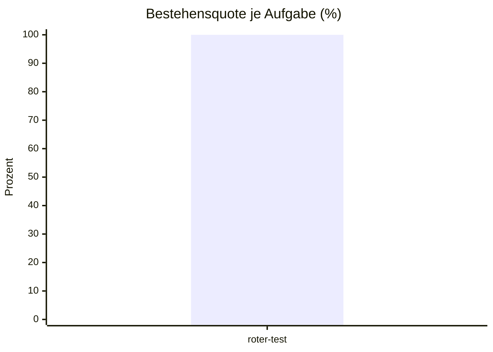

# Eval-Bericht 2026-10-08 07:02

- Commit: 0b9b330
- Modell: Standard
- Läufe: 1 je Aufgabe, bestanden ab 1
- Kosten: $0.1515
- Dauer: 52 s

| Aufgabe | Läufe | Ergebnis | Kosten | Erste fehlgeschlagene Prüfung |
| --- | --- | --- | --- | --- |
| roter-test | 1/1 | bestanden | $0.1515 | - |

## Bestehensquote

## Auffälligkeiten

- keine
