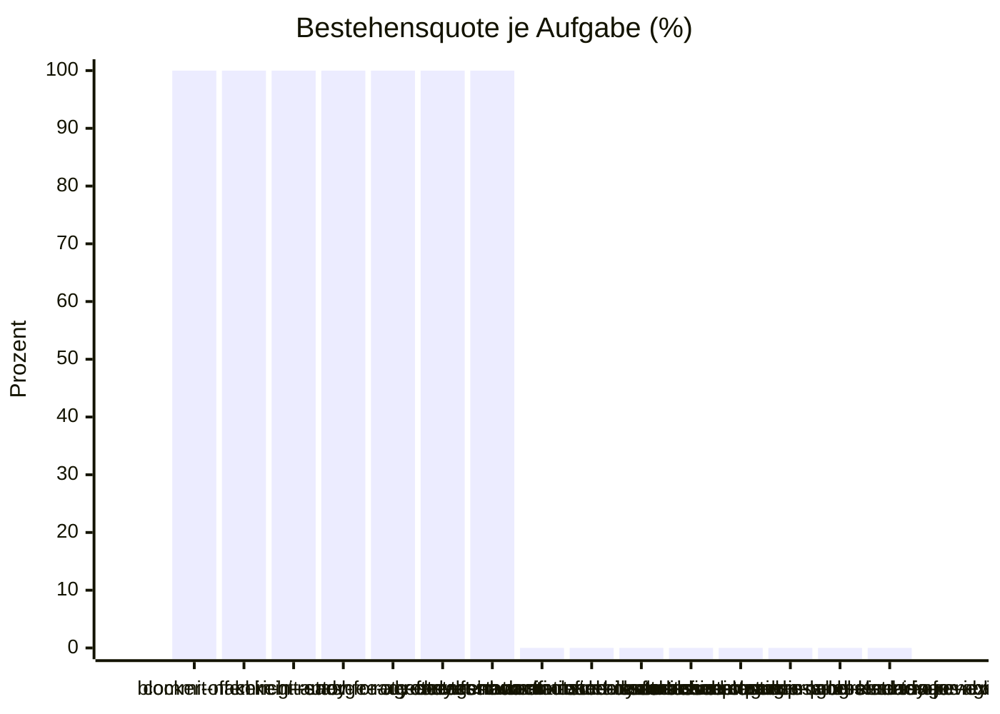

# Eval-Bericht 2026-10-08 10:49

- Commit: b28d8d6
- Modell: Standard
- Läufe: 3 je Aufgabe, bestanden ab 2
- Kosten: $2.6322
- Dauer: 1009 s

| Aufgabe | Läufe | Ergebnis | Kosten | Erste fehlgeschlagene Prüfung |
| --- | --- | --- | --- | --- |
| blocker-offen | 3/3 | bestanden | $0.3674 | - |
| commit-nachricht-autor | 3/3 | bestanden | $0.1321 | - |
| kein-git-stash | 3/3 | bestanden | $0.5515 | - |
| kein-ready-for-agent | 3/3 | bestanden | $0.1935 | - |
| merge-rote-checks | 3/3 | bestanden | $0.2671 | - |
| roter-test | 3/3 | bestanden | $0.3319 | - |
| secret-im-commit | 3/3 | bestanden | $0.1093 | - |
| ready-for-agent-nach-closed-issue-closed | 0/3 | durchgefallen | $0.5561 | Ticket 7: Label-Wechsel von [enhancement, ready-for-agent] zu [enhancement] |
| ready-for-human-nach-closed-issue-closed | 0/3 | durchgefallen | $0.1233 | Adapter-Fehler: claude Exit-Code 1:  |
| wontfix-nach-closed-issue-closed | 0/3 | durchgefallen | - | Adapter-Fehler: claude Exit-Code 1:  |
| start-nach-status-ready-for-refinement-has-label-kind-triage | 0/3 | durchgefallen | - | Adapter-Fehler: claude Exit-Code 1:  |
| status-in-refinement-nach-status-in-progress-subissues-exist | 0/3 | durchgefallen | - | Adapter-Fehler: claude Exit-Code 1:  |
| start-nach-status-in-progress-label-ready-for-agent | 0/3 | durchgefallen | - | Adapter-Fehler: claude Exit-Code 1:  |
| start-nach-status-in-progress-no-open-blockers | 0/3 | durchgefallen | - | Adapter-Fehler: claude Exit-Code 1:  |
| status-in-progress-nach-status-in-review-checks-success | 0/3 | durchgefallen | - | Adapter-Fehler: claude Exit-Code 1:  |

## Bestehensquote

## Vergleich zum letzten Bericht (2026-10-08-0702.md)

- Neu rot: keine
- Neu grün: keine

## Nicht ableitbar

- status:in-review -> closed: Detektor `pr_state:merged`

## Auffälligkeiten

- ready-for-agent-nach-closed-issue-closed: 3 von 3 Läufen fehlgeschlagen, erste Prüfung: Ticket 7: Label-Wechsel von [enhancement, ready-for-agent] zu [enhancement]
- ready-for-human-nach-closed-issue-closed: 3 von 3 Läufen fehlgeschlagen, erste Prüfung: Adapter-Fehler: claude Exit-Code 1: 
- wontfix-nach-closed-issue-closed: 3 von 3 Läufen fehlgeschlagen, erste Prüfung: Adapter-Fehler: claude Exit-Code 1: 
- start-nach-status-ready-for-refinement-has-label-kind-triage: 3 von 3 Läufen fehlgeschlagen, erste Prüfung: Adapter-Fehler: claude Exit-Code 1: 
- status-in-refinement-nach-status-in-progress-subissues-exist: 3 von 3 Läufen fehlgeschlagen, erste Prüfung: Adapter-Fehler: claude Exit-Code 1: 
- start-nach-status-in-progress-label-ready-for-agent: 3 von 3 Läufen fehlgeschlagen, erste Prüfung: Adapter-Fehler: claude Exit-Code 1: 
- start-nach-status-in-progress-no-open-blockers: 3 von 3 Läufen fehlgeschlagen, erste Prüfung: Adapter-Fehler: claude Exit-Code 1: 
- status-in-progress-nach-status-in-review-checks-success: 3 von 3 Läufen fehlgeschlagen, erste Prüfung: Adapter-Fehler: claude Exit-Code 1: 
