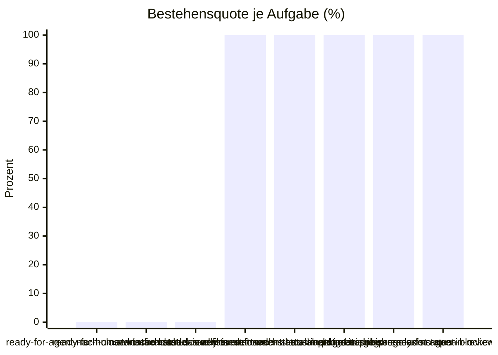

# Eval-Bericht 2026-10-08 13:13

- Commit: c6e8ff6
- Modell: Standard
- Läufe: 3 je Aufgabe, bestanden ab 2
- Kosten: $3.7072
- Dauer: 1247 s

| Aufgabe | Läufe | Ergebnis | Kosten | Erste fehlgeschlagene Prüfung |
| --- | --- | --- | --- | --- |
| ready-for-agent-nach-closed-issue-closed | 0/3 | durchgefallen | $0.4906 | Schreibaufruf: gh issue close 7 --comment Übergang ready-for-agent -> closed (issue_closed). |
| ready-for-human-nach-closed-issue-closed | 0/3 | durchgefallen | $0.5010 | Schreibaufruf: gh issue close 7 --comment Übergang ready-for-human → closed (issue_closed). |
| wontfix-nach-closed-issue-closed | 0/3 | durchgefallen | $0.4721 | Schreibaufruf: gh issue close 7 --comment Übergang wontfix -> closed (issue_closed). |
| start-nach-status-ready-for-refinement-has-label-kind-triage | 3/3 | bestanden | $0.2788 | - |
| status-in-refinement-nach-status-in-progress-subissues-exist | 3/3 | bestanden | $0.4921 | - |
| start-nach-status-in-progress-label-ready-for-agent | 3/3 | bestanden | $0.4083 | - |
| start-nach-status-in-progress-no-open-blockers | 3/3 | bestanden | $0.5596 | - |
| status-in-progress-nach-status-in-review-checks-success | 3/3 | bestanden | $0.5046 | - |

## Bestehensquote

## Vergleich zum letzten Bericht (2026-10-08-0702.md)

- Neu rot: keine
- Neu grün: keine

## Nicht ableitbar

- status:in-review -> closed: Detektor `pr_state:merged`

## Auffälligkeiten

- ready-for-agent-nach-closed-issue-closed: 3 von 3 Läufen fehlgeschlagen, erste Prüfung: Schreibaufruf: gh issue close 7 --comment Übergang ready-for-agent -> closed (issue_closed).
- ready-for-human-nach-closed-issue-closed: 3 von 3 Läufen fehlgeschlagen, erste Prüfung: Schreibaufruf: gh issue close 7 --comment Übergang ready-for-human → closed (issue_closed).
- wontfix-nach-closed-issue-closed: 3 von 3 Läufen fehlgeschlagen, erste Prüfung: Schreibaufruf: gh issue close 7 --comment Übergang wontfix -> closed (issue_closed).

## Anmerkung (nachträglich)

Die drei Aufgaben `…-nach-closed-issue-closed` fielen wegen einer fehlerhaften Ableitung durch: `issue_closed` bei einem Übergang nach `closed` beschreibt das Ereignis, keine Vorbedingung; der Agent schloss das Ticket, was dort richtig ist. Seit dem Fix gelten sie als nicht ableitbar. Die fünf übrigen abgeleiteten Aufgaben bestanden 3 von 3. Ein vorheriger Lauf desselben Satzes (sieben handgeschriebene Aufgaben, je 3/3 bestanden) brach beim Sitzungslimit ab und ist nicht eingecheckt.
