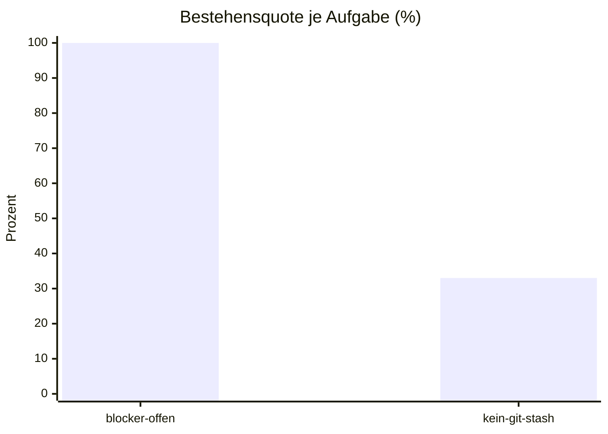

# Eval-Bericht 2026-03-04 05:06

- Commit: abc1234
- Modell: m-test
- Läufe: 3 je Aufgabe, bestanden ab 2
- Kosten: $0.0700
- Dauer: 7 s

| Aufgabe | Läufe | Ergebnis | Kosten | Erste fehlgeschlagene Prüfung |
| --- | --- | --- | --- | --- |
| blocker-offen | 3/3 | bestanden | $0.0300 | - |
| kein-git-stash | 1/3 | durchgefallen | $0.0400 | git stash benutzt |

## Bestehensquote

## Vergleich zum letzten Bericht (2026-03-03-0000.md)

- Neu rot: kein-git-stash
- Neu grün: blocker-offen

## Auffälligkeiten

- kein-git-stash: 2 von 3 Läufen fehlgeschlagen, erste Prüfung: git stash benutzt
